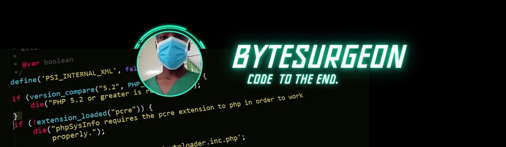

## 

## Skills

### Version Control, Editors, and Design Tools

### Backend, Frontend, and Programming Languages

### DevOps, Deployment, and Additional Tools

  <table>
    <tr>
      <td></td>
      <td></td>    
    </tr>
  </table>

---

### 💬 CONNECT WITH ME:

Feel free to reach out if you want to collaborate on projects, have any questions, or just want to connect!

- **Email:** [wachiraamos402@gmail.com](mailto:wachiraamos402@gmail.com)
- **LinkedIn:** [Amos Wachira](https://www.linkedin.com/in/amos-wachira-27901b244/)
- **Portfolio:** [Amos Wachira](https://amoswachira.cloud)

---

### ⚡ FUN FACT:

Did you know that the first computer bug was an actual bug? In 1947, computer scientist Grace Hopper and her team found a moth trapped in a relay of the Harvard Mark II computer. They recorded the incident in their logbook, calling it the "first actual case of bug being found." This is where the term "debugging" originated! 🐛

---

### 

---
